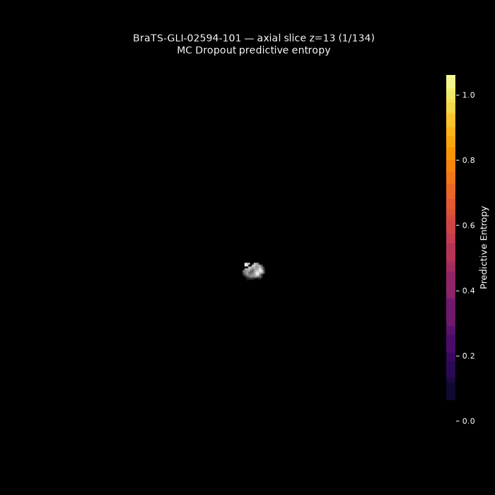
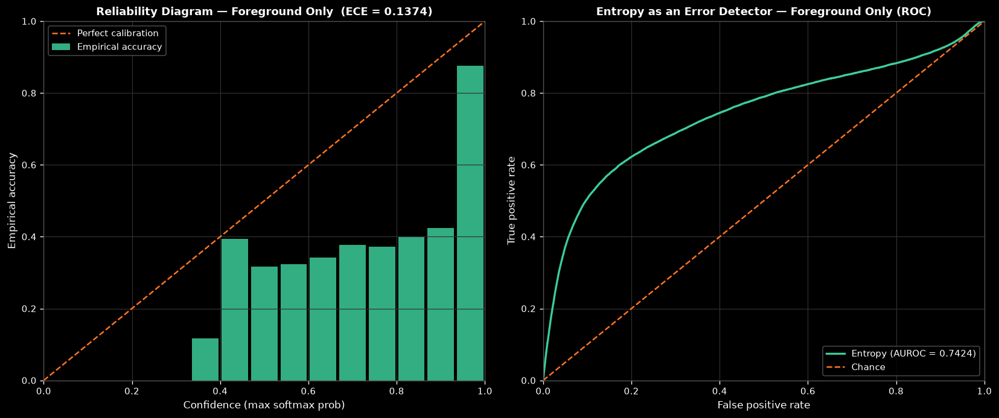

# Uncertainty-Aware Brain Tumor Segmentation

Segmentation of adult glioma sub-regions on **post-treatment** MRI (BraTS 2024 GLI), with a
per-voxel uncertainty map that tells you where the model's contour is likely to be wrong.

<p align="center">
  
</p>

*One held-out subject swept slice by slice through the axial plane, with the predictive entropy from
20 Monte Carlo Dropout passes overlaid on the T1c image. Entropy sits at essentially zero across
healthy tissue and inside confidently segmented regions, and rises in thin bands along the tumor
boundaries — exactly where the delineation is genuinely ambiguous. Regenerate it with
[`v2/visualize_uncertainty_gif_v2.py`](v2/visualize_uncertainty_gif_v2.py).*

---

## The problem

Automatic delineation of glioma sub-regions on multi-parametric MRI supports surgical planning,
radiotherapy targeting and response assessment, but manual contouring is slow and inconsistent. The
BraTS 2024 adult glioma post-treatment (GLI) cohort makes the task harder: scans acquired after
resection and chemoradiation contain surgical cavities, treatment-related signal changes and possible
pseudoprogression, which can both mimic residual tumor and hide it.

A further obstacle to clinical use is that segmentation networks are typically overconfident and give
no indication of where their contours are likely to be wrong — precisely the information a
radiologist reviewing an automatic contour would want.

## Approach

A single **attention-gated 3D U-Net** (21.8M parameters) with **Monte Carlo Dropout** kept active at
test time, so 20 stochastic passes yield both an averaged segmentation and a per-voxel
predictive-entropy map. No ensembles, no multi-GPU training — everything here fits on one RTX 3060.

- **Architecture** — four encoder stages (32 → 256 channels) plus a 320-channel bottleneck,
  instance norm + LeakyReLU, learned stride-2 downsampling, trilinear upsampling. Attention gates on
  every skip connection let the decoder suppress background-dominated encoder features, which matters
  when enhancing tumor is ~0.36% of all voxels.
- **Uncertainty** — `Dropout3d(p=0.15)` in the bottleneck and the two deepest decoder blocks, left on
  at inference. Prediction is the argmax of the mean softmax over 20 passes; uncertainty is the
  predictive entropy of that mean.
- **Training** — Dice Focal loss (background excluded), AdamW (lr 2e-4, weight decay 1e-4), 5-epoch
  linear warmup then cosine annealing. Augmentation: random flips on all three axes, per-modality
  intensity scale/shift, Gaussian noise.
- **Data** — 1,621 labeled subjects, split once with a fixed seed into 1,297 for training and a
  persistent 324-subject holdout that every number below is measured on. The official 188-subject
  validation set could not be scored: the BraTS 2024 evaluation platform closed before submission.
- **Cost** — ~48 h to train (best checkpoint at epoch 108); 0.6 s for a single forward pass over a
  full volume, 11.6 s for the full 20-pass MC inference.

## Results

Held-out split, 324 subjects. The baseline is a capacity-matched plain 3D U-Net (v1) trained on the
same data, so the comparison isolates the attention gates and the stronger augmentation rather than
confounding them with model capacity.

| Model | Dice TC | Dice WT | Dice ET | **Dice mean** | HD95 TC | HD95 WT | HD95 ET | **HD95 mean (mm)** |
|---|---|---|---|---|---|---|---|---|
| Plain 3D U-Net (baseline) | 0.8638 | 0.9087 | 0.8503 | 0.8743 | 5.65 | 6.11 | 5.74 | 5.83 |
| Attention U-Net, deterministic | 0.8791 | 0.9206 | 0.8613 | **0.8870** | 4.83 | 4.87 | 5.06 | **4.92** |
| Attention U-Net, MC Dropout (20 passes) | 0.8791 | 0.9205 | 0.8612 | 0.8869 | 4.84 | 4.85 | 5.07 | 4.92 |

The attention gates improve every region and every metric, with the largest relative gain on
boundary quality (~16% lower mean HD95). MC Dropout leaves accuracy essentially untouched — that is
the intent. Dropout sits in three blocks to generate uncertainty, not to boost Dice; the payoff is
the entropy map, not a fourth decimal place.

## Does the uncertainty mean anything?

Three checks, all on the same holdout.

**1. Entropy separates errors from correct predictions** (20 passes, whole-tumor binarization):

| Voxel outcome | Mean entropy |
|---|---|
| True negative (correct background) | 0.0002 |
| True positive (correct tumor) | 0.0285 |
| False negative | 0.1112 |
| False positive | 0.1960 |

False positives carry ~6.9× the entropy of true positives, false negatives ~3.9×. The asymmetry is
itself informative: when the model hallucinates tumor it tends to know it is unsure, whereas a
minority of missed voxels are missed confidently.

**2. Whole-brain calibration looks excellent** — expected calibration error **0.008**, and entropy
alone detects misclassified voxels at **AUROC 0.896** (50 subjects, brain-mask restricted).

**3. Tumor-only calibration tells the honest story.** Background is 98.8% of the volume and is
predicted correctly with near-certainty, so it dominates every confidence bin. Restricted to
foreground voxels, mean confidence is 0.983 against an accuracy of 0.846, ECE rises to **0.137**, and
the error-detection AUROC drops to **0.742**.

<p align="center">
  
</p>

So the entropy map is a useful pointer to regions of a contour worth double-checking — but within
tumor tissue it is not a calibrated probability, and it should not be read as one. A worked example
of a high-entropy subject is in
[`v2/results_summary/examples_entropy_extremes/`](v2/results_summary/examples_entropy_extremes/).

## Repo layout

The root is the **v1 baseline** pipeline; `v2/` holds the attention model that produced the results
above and is where active work lives.

| Path | What it is |
|---|---|
| `preprocess.py` | Raw NIfTI → H5: normalize, remap label 4 → 3, crop to brain, pad to 160×208×160 |
| `model.py`, `dataset.py`, `train.py`, `evaluate.py` | v1 plain 3D U-Net baseline |
| `v2/model_v2.py` | `UNet3DAttn`, `AttentionGate`, `mc_inference()` |
| `v2/dataset_v2.py`, `v2/train_v2_1.py` | Augmented dataset with a persistent split; training loop |
| `v2/evaluate_v2.py` | Dice + HD95 per region, deterministic or MC |
| `v2/visualize_uncertainty_v2.py` | Entropy maps, entropy-by-outcome stats, ECE + AUROC |
| `v2/calibration_foreground_only.py` | The same calibration analysis with background excluded |
| `v2/visualize_uncertainty_gif_v2.py` | Animated entropy sweeps, including the GIF at the top of this file |
| `v2/results_summary/` | Presentation-ready copy of the headline figures and tables |
| `v2/README.md`, `v2/V2_1_ARCHITECTURE.md` | Deep dive: what changed from v1, attention-gate mechanics |
| `PROGRESS.md`, `ANALYSIS.md` | Phase-by-phase project history and literature comparison |

## Reproducing

```bash
pip install -r requirements.txt

# 1. Raw BraTS NIfTI → processed/{train,val}/*.h5
python preprocess.py

# 2. Train the attention model (add --resume to continue from latest_checkpoint.pth)
cd v2 && python train_v2_1.py

# 3. Dice + HD95 on the held-out split, deterministic and with MC Dropout
python evaluate_v2.py --checkpoint checkpoints_v2_1/best_model.pth --mc_passes 0
python evaluate_v2.py --checkpoint checkpoints_v2_1/best_model.pth --mc_passes 20

# 4. Uncertainty maps + calibration
python visualize_uncertainty_v2.py --checkpoint checkpoints_v2_1/best_model.pth
python calibration_foreground_only.py --checkpoint checkpoints_v2_1/best_model.pth

# 5. Figures and animated entropy sweeps
python inference_report_v2.py --checkpoint checkpoints_v2_1/best_model.pth --out_dir inference_report_v2_1
python visualize_uncertainty_gif_v2.py --checkpoint checkpoints_v2_1/best_model.pth --n_subjects 10
```

The trained checkpoint (`v2/checkpoints_v2_1/best_model.pth`, epoch 108, 261 MB) is tracked with
**Git LFS** — run `git lfs install` before cloning, or the file arrives as a text pointer. The
persistent holdout (`v2/checkpoints_v2_1/val_split.json`) is committed alongside it so the split is
reproducible without retraining.

The BraTS 2024 GLI data itself is not in this repo — request access from the challenge organizers
(see the challenge paper linked below). Unpack it as `BraTS2024-BraTS-GLI-*Data/` and point
`ROOT` at the top of `preprocess.py` to wherever that lives before running step 1.

## Authors

Hadas Avraham and Sahar Ifrah — Tel Aviv University.

Key references: [Attention U-Net](https://arxiv.org/abs/1804.03999) (Oktay et al., 2018),
[MC Dropout](https://arxiv.org/abs/1506.02142) (Gal & Ghahramani, 2016),
[BraTS 2024 post-treatment glioma challenge](https://arxiv.org/abs/2405.18368) (de Verdier et al.,
2024).
